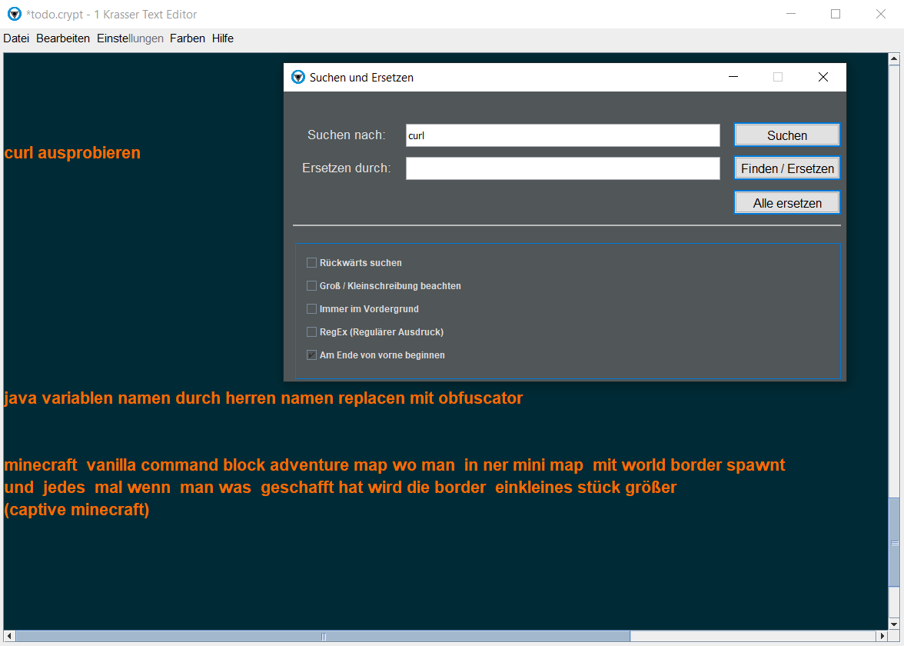
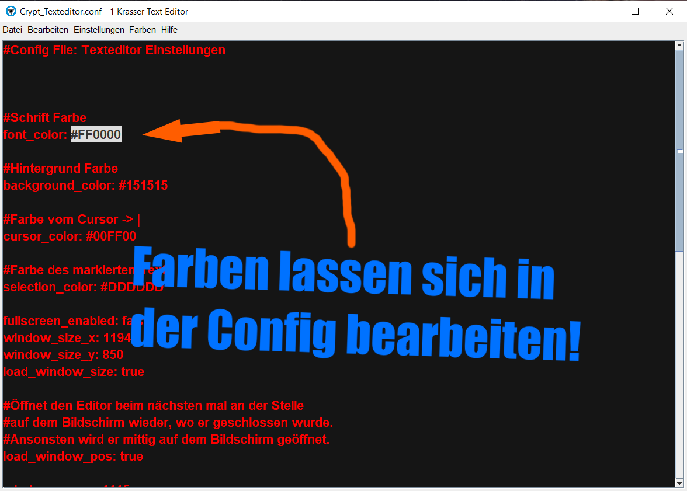

# Texteditor mit Verschlüsselung

Ein Texteditor ähnlich wie der Windows-Editor, nur mit AES256-Verschlüsselung und in Farbe. gemacht von mir (Di0nysus) und NightDev701

## Installation und Start

Zum Starten `Editor.exe` ausführen.  
Zum Öffnen mit Konsolenfenster `Debug.exe` ausführen.

## Verschlüsselung von Textdateien

Um eine Textdatei zu verschlüsseln, wähle beim Speichern als Dateityp `.crypt` aus, klicke auf Speichern und gib ein Passwort ein. Dieses Passwort musst du später beim Öffnen der `.crypt`-Datei eingeben. 

Wenn du überprüfen willst, ob die `.crypt`-Datei auch wirklich verschlüsselt ist, öffne sie doch mal mit dem Windows-Editor.

`Editor.exe` öffnet einfach nur `editor.jar` mit den gegebenen Startparametern.

## .crypt-Dateien als Standard in Windows öffnen

Damit alle `.crypt`-Dateien mit dem Editor geöffnet werden, füge die `Editor.exe` als Standardanwendung für `.crypt`-Dateien in Windows hinzu:

1. Erstelle eine Verknüpfung von `Editor.exe`.
2. Mache einen Rechtsklick auf eine `.crypt`-Datei.
3. Wähle `Öffnen mit`.
4. Wähle `Andere App auswählen`.
5. Setze den Haken bei `Immer diese App zum Öffnen...`.
6. Scrolle ggf. herunter.
7. Wähle `Weitere Apps`.
8. Wähle `Andere App auf diesem PC suchen`.
9. Wähle die Verknüpfung von `Editor.exe`.

## Programm über die Windows-Suchzeile öffnen

Um das Programm über die Windows-Suchzeile öffnen zu können, erstelle eine Verknüpfung von `Editor.exe` und verschiebe diese in den Pfad:  
`C:\Users\%username%\AppData\Roaming\Microsoft\Windows\Start Menu\Programs`.

## Version 2

Dieses Programm funktioniert nicht im `C:\program files`-Verzeichnis, weil es dort mangels Admin-Rechten die Config-Datei nicht schreiben kann.

## Systemanforderungen

Gemacht für Java 8!  
Läuft bestimmt auch auf neueren Java-Versionen, ist aber nicht getestet.

## Screenshots

